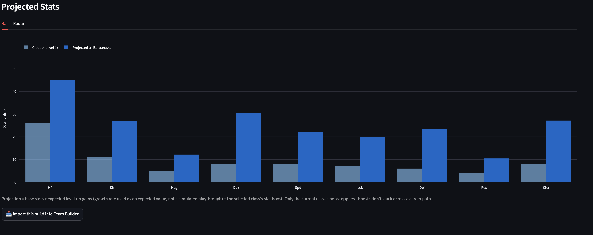

# Three Houses Class Optimizer

An interactive tool for Fire Emblem: Three Houses that recommends a class path for any character - either toward their natural strengths (auto-detected from growth rates) or a role you choose - and projects their stats at a target level.

Built as a portfolio project. Started as a Pokemon competitive team-builder; pivoted here to dig into a genuinely different kind of problem: simulating stat growth and class progression rather than looking up static competitive data.




## Features

- Scrapes character base stats, growth rates, and class stat boosts directly from [Serenes Forest](https://serenesforest.net/three-houses/)
- **Auto-detected role** - infers what a character is naturally good at from their growth rates, standardized against the roster and compared via cosine similarity against 5 role archetypes: Physical Attacker, Magic Attacker, Tank, Support, Speed/Precision - no input needed. Speed/Precision weights Speed only now (Movement dropped entirely, from both role detection and class scoring) - Movement is a positioning stat almost every class boosts similarly, so it was diluting the role's actual signal rather than reflecting a genuine "built for speed" pick.
- **Manual role targeting** - override the auto-detection to ask "what if I built this character as a mage instead?"
- **Class path recommendation** - best-fitting class at each tier (Beginner -> Intermediate -> Advanced -> Master) toward the target role, truncated to whichever tiers are actually reachable at the target level (e.g. targeting level 15 stops after Intermediate, since Advanced requires level 20). Target level defaults to 30.
- **Classes have their own growth-rate modifiers, and they're factored in.** Contrary to an earlier version of this README, Three Houses classes genuinely do modify how fast specific stats climb on every level-up (`data/class_growth_rates.csv`, sourced from [Serenes Forest's growth-rates page](https://serenesforest.net/three-houses/classes/growth-rates/)) - a real mechanic distinct from a class's one-time flat certification boost (`class_stat_boosts.csv`). Both now factor into which class gets recommended at each tier (a small, deliberately-bounded scoring nudge - see `GROWTH_RATE_SCORE_WEIGHT`), and the stat projection simulates growth tier-by-tier along the character's *entire* class path (not just the final class) using each tier's own combined character + class growth rate - see "Path-wide stat simulation" below.
- **Path-wide stat simulation, not just the final class.** Projected stats used to apply a flat growth rate across the whole level range and only the final class's numbers - now growth is simulated level-band by level-band, using whichever class the path actually has the character in at each stretch of levels (`expected_stats_along_path` / `path_level_bands` in `src/optimizer.py`). The final class's flat stat *boost* is still applied only once at the end (boosts genuinely don't stack across a career path in this game), but growth *gains* are cumulative across every tier actually spent on the way there, since those level-ups already happened.
- **Each class's own base stats act as a floor at every tier, not just the final one.** A new hand-curated `data/class_base_stats.csv` (Serenes Forest's per-class base-stats page) supplies each class's own minimum stat line; on certifying into a class at any tier, if the character's simulated stat is already below that class's own base for that stat, it snaps UP to the class's base before that tier's growth is added - a floor, not an additive bonus (composes as: join-level base stats → per-tier class floor → that tier's growth → ... → the final class's one-time flat boost). This is what makes the mix-and-match projected-stats chart actually update when you change a NON-final tier, not just the final one - every tier's class choice can now change the final numbers, not only the last one.
- **Unique/story classes never show a bogus weapon-requirement line.** These are unlocked by story progression, not a certification exam, so they should never display a "Requires: ..." line - audited every Unique-tier class after Enlightened One was confirmed incorrectly showing "Requires: Sword A" (traced to a stray `Lord` row in `class_weapon_requirements.csv`); fixed at a single choke point (`NO_CERTIFICATION_CLASSES`, sourced from `class_eligibility.csv`'s own unlock notes) so it can't regress even if the CSV gains stray rows later.
- **Weapon-switch warning relaxed for mount/armor transitions.** Riding↔Flying and Heavy Armour transitions no longer flag by default - those are a real in-game skill-rank jump, but a much smaller practical cost than an entirely new weapon type, and were drowning out the warnings that actually matter. They still flag when the jump is to a high rank (A) with genuinely zero prior mount/armor practice anywhere in the path. Catherine's Swordmaster → Wyvern Lord still flags, as it should: Wyvern Lord's requirement is Lance/Axe/Flying together, and Axe is an ordinary (non-mount) skill she's never trained, so the relaxation doesn't touch her case.
- **Hero's Relics nudge class scoring toward the weapon type they use.** A new hand-curated `data/character_relics.csv` (cross-referenced against Crest-bearer data) maps each relic-bearing character to their Hero's Relic weapon type(s) - e.g. the Protagonist's Sword of the Creator, Lysithea's Thunderbrand *and* Thyrsus (she bears two minor crests). A class whose certification uses that weapon type gets a small scoring bonus (`relic_affinity_bonus`), same precedent and magnitude as the existing starting-proficiency bonus (`weapon_growth_bonus`) - the idea being a character canonically wielding a specific relic is nudged toward classes that let them actually use it.
- **Eligibility-aware** - recommendations respect character-locked and gender-locked classes (e.g. "Lord" is only ever recommended to the three house leaders, "Falcon Knight" only to characters who can access it), so the tool never suggests a class that character couldn't actually take in-game
- **Weapon requirements and natural proficiency** - every recommended class step shows its real certification-exam requirement (e.g. "Requires: Axe C and Heavy Armour D"), hand-curated from Serenes Forest; a character's own starting weapon proficiency (their highest starting skill rank(s), also sourced from Serenes Forest) feeds into the tier-agnostic weapon-affinity fallback used when a tier's stat-boost data alone can't distinguish physical from magic classes, and into a small score bonus for a class that plays to a weapon type the character is already strong in (`weapon_growth_bonus`)
- **Weapon-type switches are flagged, not free.** A big, un-telegraphed weapon-type jump (e.g. a Sword-natural character's path landing on Wyvern Lord, which needs Lance/Axe/Flying all at once) now costs a small score penalty and surfaces an explicit "weapon switch" warning on that step and in the character/team summary - respecting each class's real AND/OR certification shape (an AND requirement like Wyvern Lord's needs *every* listed skill already familiar to count as a non-switch, not just one). This was the "Catherine going Swordmaster to Wyvern Lord is very difficult in practice" gap - the stat numbers alone made that jump look free.
- **Mix and match** - override the recommended class at any tier with any other class that character is eligible for, and see the projected stats recompute for whichever tier you actually end on (only the current/final class's boost applies in-game, same as before - the earlier tiers are still independently browsable for path comparison); your own pick shows the same fit score, weapon-rank requirement, and growth-rate modifiers the recommended pick does, not just "your pick, overrides the recommendation." Switching the target role now correctly resets every tier's selection to that role's own recommendation, instead of silently keeping the previous role's picks selected.
- **Stat projection with two chart types, bar by default** - expected stats at a chosen level, shown as a grouped bar chart (the default view) AND a before/after radar chart against the character's own base stats, so you can read exact per-stat deltas (bar) or compare shape (radar). Hover tooltips are no longer clipped at the top of the chart.
- **Join level modeled, not just Level 1** - base stats and the stat projection start from each character's own join level (`data/character_starting_level.csv`), not a uniform Level 1 - a target level below that is floored to their join level instead of projecting them as if they started from scratch. Verified as Level 1 for the Protagonist and all 24 house students; later joiners (Church/Knights of Seiros staff, DLC characters) use an approximate placeholder - see Known Simplifications.
- **"Why" explanations** - every recommended class step, and every team member's slot, comes with a plain-language reason (the stat boosts that drove it, a class that grows a weapon rank the character is already strong in, or - when the tier's stat data genuinely can't differentiate a role, like Magic vs. Physical at Beginner tier - the certification weapon/magic requirement and starting-proficiency match that did instead)
- **Support always ends in a class with real magic access** - the Support role's fit score is driven by Resistance, which several purely physical/flying classes (Falcon Knight) also boost - those are now excluded from Support's candidate pool at every tier, so a healer-archetype character never ends up in a class that can't actually cast healing magic
- **Character-unique classes are incorporated as options, weighted higher** - Byleth's Enlightened One and the three lords' Armored Lord/High Lord/Wyvern Master → Emperor/Great Lord/Barbarossa are spliced into the recommended path at their documented tier (rather than only surfacing in a separate "also eligible for" list) and preferred whenever they're a reasonable fit for the target role - it's each character's own canonical class in the story, not just another statistically-scored option
- **Byleth and the route's own lord are force-deployed in Team Builder, and say so** - Byleth is force-deployed on every route, including "Full roster" (there's no route they're actually benchable on); a specific route's own lord is force-deployed on top of that. Both are labeled "Force-deployed - the game requires them on this route's roster," not the generic "Included by request." a manually must-included character gets, and a toggle ("Force-deploy Byleth and the route's own lord," on by default) lets you turn this off and build purely from fit scoring instead
- **Route-aware team building, including Silver Snow** - Black Eagles splits into two selectable routes: Crimson Flower (Edelgard stays) and Silver Snow (Edelgard and Hubert leave permanently around Chapter 11 and become unrecruitable). Blue Lions and Golden Deer are each one pool. Every route's pool is that route's own house students plus the Protagonist and the Church/Knights of Seiros staff, who are recruitable on any route; DLC-exclusive characters (Cindered Shadows) are opt-in and clearly tagged `(DLC)` everywhere they appear, never mixed in silently
- **DLC classes are now usable, opt-in** - the four Cindered Shadows certification classes (Trickster, War Monk/Cleric, Dark Flier, Valkyrie) previously existed in the data but were never actually reachable by any recommendation path. A separate "Include DLC classes" toggle (distinct from "Include DLC characters," since any character can use these if you own the DLC) now merges them into the Advanced tier's candidate pool.
- **Import a build from the Character Optimizer into the Team Builder** - once you've picked a character's class path (including any mix-and-match overrides, at every tier, not just the final one), "Import this build into Team Builder" locks that exact path/stats in for the Team Builder tab, so it's used as-is (and the character is force-included) instead of Team Builder silently recomputing its own recommendation - or silently reverting an earlier-tier override back to the original recommendation - for them. Fixed two related bugs here: an imported build no longer mismatches between the two tabs, and overriding a tier no longer leaves that tier's displayed certification requirement/fit score/weapon-switch warning referring to whatever class was originally recommended there - every tier is now recomputed from the actual selection, in path order, on import.
- **Class Explorer** - a tab for browsing any class's stat profile: its flat one-time certification boost AND its own growth-rate modifiers (a separate mechanic - see above), each as its own bar chart tab, with an optional side-by-side comparison against a second class and each class's tier/certification requirement shown alongside.
- **Deeper recruitment modeling** - an optional "Model recruitment requirements" toggle additionally considers students from a route's other two houses, gated by their real in-game recruitment requirement (a Byleth-level threshold - the target level slider stands in for it - plus a stat/skill-rank requirement shown as a note). House leaders and their sworn retainers are never recruitable this way, matching the game
- **Team variety and targeting** - "Different team, same pool" regenerates via weighted-random picks instead of the same deterministic top-scorers every time; "Must include" / "Exclude" let you build around specific characters instead of only ever getting the tool's own picks (and a name in both now correctly wins as "included," instead of silently vanishing)
- **Portrait support (bring your own art, or house-colored tiles by default)** - the UI will show a character portrait from `assets/portraits/` if you provide one. Otherwise - the default for virtually everyone, since actual Three Houses character art isn't bundled (see `assets/portraits/README.md`) as it isn't this project's IP to redistribute - the placeholder tile is color-coded by that character's own house/route (Black Eagles, Blue Lions, Golden Deer, Church/Knights of Seiros, the Protagonist's own house, DLC-exclusive), so portraits are still visually meaningful at a glance without any actual art at all.
- **Byleth's portrait respects the gender you pick, if you've added both.** Byleth's gender is a player choice in-game rather than a fixed trait, so a single `protagonist.png` can only ever show one of them - add `byleth_m.png`/`byleth_f.png` instead (see `assets/portraits/README.md`) and a "Byleth's portrait" selector next to the app's title picks between them everywhere Byleth's portrait appears (Character Optimizer, Team Builder roster cards). Purely cosmetic - Byleth's gender is already recorded as `Any` in `data/character_gender.csv` and never blocks a gender-locked class either way (see `is_class_eligible`), so this selector doesn't change any recommendation.
- **Growth-rate visualization on the Character Optimizer tab itself** - each tier in the recommended class path now has a "📈 Growth-rate modifiers" expander showing that class's own per-stat growth-rate modifiers as a compact horizontal mini bar chart (all 9 stats, colored by sign), not just the Class Explorer tab's larger chart and not just a 2-stat text summary.
- **Dancer as a single roster-wide slot in Team Builder** - only one character can hold the Dancer class per playthrough (it's unlocked via the White Heron Cup event, not a certification exam, and isn't reachable by the normal Beginner→Master recommendation ladder at all), so after building a team you can optionally assign it to exactly one member via a single selectbox (the Protagonist excluded, matching the game) - not a class every member could be freely/independently recommended into.
- **Automated tests** - a stdlib `unittest` suite (`tests/`) covering the recommendation logic, team building, and a structural smoke test of the Streamlit app itself; see Testing below
- **A character's own Hero's Relic and starting proficiency now feed auto-detection itself, not just class scoring.** "How is Lorenz's relic factored in? He's still suggested as a tank while his relic only supports mages" was a real gap - `detect_natural_role` compared growth rates alone, with no awareness of what weapon type a character actually wields. A new small `natural_role_affinity_bonus` folds in the same relic/proficiency data the class-scoring bonus already used (see `character_relics.csv` above), nudging *role detection itself* toward a role whose typical weapon category matches - verified to flip Lorenz from Tank to Support on a genuinely close growth-rate call, without disturbing characters whose growth-rate lean is already decisive (Edelgard's strong Physical Attacker read is untouched by the same mechanism). It's a small nudge on an already-close call, not a hard override - see `score_all_roles`.
- **A character-unique class no longer gets spliced into a role it structurally can't fill.** "Dimitri gets suggested in his unique class for the magic-attacking role, but his unique class has no magic access" - the unique-class splice/scoring bonus (see "Character-unique classes" above) previously applied unconditionally, regardless of which role was being targeted. `unique_class_weapon_category` derives each unique class's physical/hybrid weapon category from its own Mag stat-boost/growth data (no new hand-curated data needed), and the splice/bonus now only fires when that category is actually compatible with the targeted role (`role_compatible_with_weapon_category`) - Dimitri's/Claude's unique classes no longer get pulled into a Magic Attacker path they can't function in, while a role their unique class genuinely fits (e.g. Physical Attacker) is unaffected.
- **Byleth's chosen gender now gates gender-locked class eligibility, not just the portrait.** War Master (male-only) and Falcon Knight (female-only) were being checked against `character_gender.csv`'s permanent "Any" value for the Protagonist - correct as a row in that CSV, but wrong for eligibility once a specific gender is actually picked in the UI. `recommend_for_character` now accepts a `character_gender_override` (threaded through the Character Optimizer, Team Builder, and Build Comparer tabs, wired to the same "Byleth's gender" selector the portrait already used), so switching Byleth's gender now correctly opens/closes War Master and Falcon Knight the way it would in-game, without touching every other character's gender data.
- **Portraits fixed at the data level, not just resized harder.** "Portraits are blurry" turned out to be mostly a data-integrity problem, not a resolution one: seven files in `assets/portraits/` were entirely non-image content (an HTML error page or a JS file saved with a `.png` name - almost certainly a failed scrape saved without checking what actually came back), and the other 34 were valid, high-resolution WebP images mislabeled with a `.png` extension. The seven corrupt files have been removed; the 34 mislabeled ones have been re-saved on disk as genuine PNGs. On top of that data cleanup, portraits are now explicitly decoded via Pillow (which sniffs real file content instead of trusting the extension), center-cropped to square, resized with high-quality LANCZOS filtering, and embedded as a base64 PNG data URI (`_load_portrait_data_uri`) instead of handed to `st.image()` as raw files - so a future mislabeled or corrupt file degrades to the color-coded tile instead of a broken-image icon or a crash, and every genuine portrait renders at a consistent, correctly-labeled, sharply-resized quality everywhere it appears.
- **Final class-path requirement display now shows every tier's skill-rank requirement, not just the last one.** A path like Paladin → War Master used to caption only War Master's own requirement; `format_combined_requirements`/`combined_requirements_for_classes` now walk every class actually in the path and show the combined list (e.g. "B Lances, B Riding, A Axes, A Brawling") - visible on the Character Optimizer tab, Team Builder roster cards, and the Build Comparer tab.
- **"How well does this character fit every role?"** - an expander on the Character Optimizer tab (`render_role_fit_chart`) showing a character's growth-rate fit-similarity score across all five role archetypes as a horizontal bar chart, not just whichever one auto-detection picked as the "best" - so you can see, e.g., that a character is a close Tank/Support call rather than only ever seeing the single winner.
- **Growth-rate breakdown as a stacked bar chart, selectable by tier.** `render_growth_stack_chart` on the Character Optimizer tab plots a character's own per-stat growth rate together with the selected class's own growth-rate modifier stacked on top, with a tier selector (defaulting to the deepest tier in the actual path) so you can see the combined growth rate for any step of the path, not just the final one.
- **Build Comparer tab** - a fourth tab extending the Class Explorer's two-class comparison to full recommended builds: two independent character/role/level pickers, each running its own path recommendation, with the two final projected-stat lines overlaid on one grouped bar chart for a direct read of the gap (covers comparing two different characters, the same character under two roles, or the same character at two target levels, all through the same UI). Compares recommended paths only - use the Character Optimizer tab for mix-and-match fine-tuning of one specific build.
- **The overall weapon-switch warning now tracks your actual selection, not the tool's original recommendation.** Overriding a flagged tier via mix-and-match previously left the summary banner showing a stale warning, since it was computed once from the original `recommend_for_character` result and never recomputed. `path_weapon_switch_warning` recomputes the summary from whatever path is actually selected after every mix-and-match override, tier by tier, so the banner clears the moment none of the currently-selected classes require an untrained weapon type - and stays up if a different tier still does.
- **When you change a class via mix-and-match, the stats it actually moves for your target role are called out.** `role_relevant_stat_deltas` narrows a class's full stat-boost line down to just the stats your targeted role's scoring actually weights, shown as a compact "+X Str, +Y Dex" caption next to both the recommended pick and any override - instead of needing to read a full 9-stat boost line to figure out whether a swap helped the role you're actually building toward.
- **Emoji removed from the UI**, except the import-related 📥 icon (kept since it's a recognizable, singular affordance rather than decoration).

## On Class/Role Weighting (an open question, not fully resolved this round)

Raised as: "reconsider class weighting - possibly sub-weights per role (speedsters need attack power too; Petra as Wyvern Lord vs. Pegasus Knight; Marianne as Mortal Savant vs. Falcon Knight); I don't know the best way to handle this, but I think there's more that could go into our tool." Worth being explicit about what this round did and didn't do here, rather than quietly leaving it unaddressed.

The five role archetypes (`ROLE_PROFILES`) are each a single, fixed stat-weight vector. That's a real simplification: "Speed/Precision" scores Petra's Wyvern Lord and her Pegasus Knight against the exact same weight vector, even though a player choosing between them in practice is also weighing things the single archetype can't see - Wyvern Lord trades some Speed for Defense/HP and a Flying+Axe kit, Pegasus Knight leans further into pure evasion/Speed with lower bulk. Same shape for Marianne: Mortal Savant and Falcon Knight both score reasonably under "Support" today, but they support in different ways (magic-and-utility vs. mobility-and-Resistance), and the single Support vector can't distinguish "which flavor of support" any more than it can distinguish "which flavor of speedster."

What this round DID do, which is a narrower, related slice of the same underlying problem ("the tool doesn't know enough about a class beyond its role-archetype fit"): weapon-category awareness. `unique_class_weapon_category` + `role_compatible_with_weapon_category` stop a unique class from being pulled into a role it structurally can't fill (Dimitri's unique class into Magic Attacker); `natural_role_affinity_bonus` nudges auto-detection using a character's actual relic/proficiency weapon type, not growth rates alone (the Lorenz case). Both are genuine, verified improvements, but neither is a sub-weighting system - they're targeted, data-backed nudges on specific known-bad cases, not a general answer to "how should Speed/Precision be scored differently for a glass-cannon Assassin vs. a bulkier Wyvern Lord."

Why a full sub-weighting system wasn't attempted this round: the honest problem is that there isn't a single objectively-correct sub-weight scheme to hand-curate, because "which flavor of Speed/Precision (or Support, or Tank) do you want" is a genuine playstyle preference, not a fact about the game the way a class's own stat boosts are. Hand-picking a sub-archetype per class (e.g. tagging Wyvern Lord "bulky-speed" vs. Pegasus Knight "glass-cannon-speed") would need to be done for every class in the roster, would be subjective in exactly the cases it's supposed to help with, and would be one more hand-curated dataset to keep consistent as classes get added - a materially bigger and shakier undertaking than a bounded bug fix, and one this round didn't have the scope to do carefully.

The more promising direction, not implemented here but worth scoping as its own round: expose the role weight vectors themselves as adjustable, rather than have the tool guess a sub-archetype on your behalf - e.g. an "Advanced" toggle on the Character Optimizer tab with a slider per stat under whichever role is selected (seeded from that role's current `ROLE_PROFILES` weights), so "speedsters need attack power too" becomes "turn up the Str/Mag weight under Speed/Precision yourself" instead of the tool trying to infer that you meant a specific class archetype. That keeps the judgment call where it actually belongs (with the player, who knows whether they want Petra bulky or glass-cannon) instead of the tool silently picking a side.

## Known Simplifications

Worth being upfront about, since these are real gaps between this tool and the actual game mechanics:

- **Unique classes aren't spliced into the recommended path.** Classes like Emperor and Barbarossa (character-locked to specific lords) and Falcon Knight (gender-locked) are eligibility-checked - recommendations never suggest a class a character can't access. But Unique classes specifically still don't slot into the Beginner -> Master path itself, since they're unlocked by character-specific story beats rather than a uniform level + seal requirement, so there's no principled tier to insert them at.
- **Class progression is level-gated, and every certification exam's real weapon/skill-rank requirement is now shown** (`data/class_weapon_requirements.csv`, hand-curated from Serenes Forest), **but it isn't simulated or enforced.** We model the level half exactly (Beginner=5, Intermediate=10, Advanced=20, Master=30, verified against Serenes Forest) and truncate the path accordingly. The weapon/skill-rank half (e.g. "Swordmaster needs Sword rank A") is now surfaced as a requirement string on every path step - and a character's own starting proficiency (`data/character_weapon_talent.csv`) narrows the Beginner-tier tie-break toward classes that fit their actual starting strengths - but we still don't simulate weapon-exp gain over time, so the tool can't tell you whether a given rank is actually reachable by a given level; it still assumes proficiency ranks keep pace with character level.
- **Only the final class's one-time flat stat boost is applied.** In the real game, boosts don't stack across a career path - only your current class's boost counts. The "mix and match" picker lets you choose which tier is actually your "current" one and see stats for that specific class; every other tier shown alongside it is progression flavor, not a contributor to the final numbers via the flat boost specifically. Two other mechanics DO apply at every tier along the way, not just the final one: growth-rate modifiers (see "Classes have their own growth-rate modifiers" above) and each class's own base-stat floor (see "Each class's own base stats act as a floor" above) - these are both genuinely cumulative across the whole path, unlike the flat boost.
- **Stat projections are expected values, not simulations.** A 45% growth rate contributes 0.45 expected points per level, not a simulated coin-flip per level-up. This is the right number for comparing paths against each other on average, but doesn't show the range of outcomes a real playthrough could produce.
- **Character/class eligibility data is hand-curated, not scraped.** `class_eligibility.csv`, `character_gender.csv`, `class_weapon_requirements.csv`, `character_weapon_talent.csv`, `recruitment_requirements.csv`, `class_base_stats.csv`, and `character_relics.csv` were all built by hand from Serenes Forest (cross-checked against other sources where noted in each file's loader docstring in `src/optimizer.py` / `src/team_builder.py`), rather than added to the scraper - each is a small, stable dataset that doesn't change between game updates, so a dedicated scraping path wasn't worth the complexity for any of them.
- **Dancer's roster-wide slot is a UI constraint, not a simulation of the White Heron Cup.** The Team Builder's single Dancer selectbox stops you from double-booking the class across multiple team members, but doesn't model the actual dance competition that unlocks it (any of several student characters can canonically win it, and the tool doesn't simulate that event) - it's "pick who you'd give it to," not "here's who actually wins it."
- **Hero's Relics coverage is scoped to the weapons that affect class scoring, not every named relic.** `character_relics.csv` lists actual Hero's Relic *weapons* only (each tied to a real certification weapon type) - non-weapon relics (Aegis Shield, Rafail Gem, Fetters of Dromi) aren't included, since they don't correspond to any class's weapon-type requirement. Most of the roster bears no relic at all and gets no scoring bonus from this, matching the game (relics are a minority-of-characters mechanic).
- **The Beginner-tier weapon-affinity fallback is a narrowly-scoped tie-break, not a full weapon-rank simulation.** Per Serenes Forest, all four Beginner classes give a single +1 to an unrelated stat (Myrmidon/Spd, Soldier/Dex, Fighter/Str, Monk/Res) - none boosts Magic at all, even Monk, the class that actually leads toward Mage/Priest. `apply_weapon_affinity_fallback` in `src/optimizer.py` only ever activates when the ordinary stat data is fully uninformative for a role's primary stat(s) - it doesn't touch tiers where real Mag/Str differences already decide correctly (which is every tier past Beginner).
- **Recruitment modeling still isn't a full simulation of Byleth's own playthrough.** "Model recruitment requirements" gates cross-house recruits by a Byleth-level threshold (using the target-level slider as a stand-in for how far into the game you are) and shows the real stat/skill-rank requirement (e.g. "high Magic, Faith B") as a note - but doesn't verify that stat requirement, since this tool has no model of Byleth's own stat growth across a playthrough to check it against. House leaders and their sworn retainers (Hubert, Dedue) are correctly never offered as cross-house recruits, matching the game.
- **Team variety is weighted-random, not a curated set of alternatives.** "Different team, same pool" re-samples per role weighted toward higher-scoring candidates; it can occasionally repeat the same team by chance, and it's not aiming for "the 2nd-best team" in any globally-optimal sense - just a different reasonable one.
- **Join level is exact for the Protagonist and the 24 house students (Level 1, verified), but an approximate placeholder for everyone else.** `data/character_starting_level.csv` documents each row's confidence and sourcing. Church/Knights of Seiros staff and the DLC merchant/hidden recruit (Anna, Jeritza) use a level mapped from their known recruitment *month*, not a directly-sourced level figure. The Ashen Wolves (Yuri, Balthus, Constance, Hapi) canonically auto-scale to roughly match Byleth's own level when recruited rather than joining at one fixed level, so no floor is enforced for them at all (join_level 1) - the same underlying gap as the recruitment-modeling simplification above (this tool doesn't simulate Byleth's own playthrough level).
- **"Weapon rank growth per class" is modeled as a proficiency-match bonus plus a switch penalty, not a weapon-exp simulation.** A class whose certification weapon overlaps a character's own starting weapon talent (`data/character_weapon_talent.csv`) gets a small score bonus (`weapon_growth_bonus`); a class that instead requires a weapon type never trained anywhere earlier in the path (`weapon_switch_penalty`) gets a small score penalty and a visible warning. Both are nudges on top of the existing stat-boost scoring, not a simulation of weapon-exp gain over time - the tool still can't tell you exactly how many battles it'd take to hit a given rank by a given level (see the class-progression simplification above).
- **The growth-rate scoring nudge and the weapon-switch penalty are both small by design, not hard vetoes.** `GROWTH_RATE_SCORE_WEIGHT` and `WEAPON_SWITCH_PENALTY` are calibrated to refine a genuinely close tier (or flag a real practical cost) without overriding a tier where the stat-boost data already gives a clearly better-fitting answer - a class can still win a tier despite requiring a fresh weapon type, if its stats are that much better; the warning tells you about the cost, it doesn't hide the pick.
- **A character's own unique class is strongly preferred, not absolutely forced.** The scoring bonus (`UNIQUE_CLASS_SCORE_BONUS`) is large enough to win in every case tested across the roster, but it's additive on top of the normal fit score, not a hard override - a wildly mismatched target role (e.g. manually targeting "Support" for a lord) could in principle still lose to a dedicated class at that tier, the same way a real player wouldn't be forced into their personal class either.
- **DLC classes are placed at Advanced tier by convention, not because the game assigns them one.** Cindered Shadows classes don't fit the base game's Beginner→Master ladder at all; their real certification requirements (B-rank pairs) read closer to Advanced-tier than Master-tier, which is the basis for merging them into the Advanced tier's candidate pool when opted in - not a sourced claim about their "official" tier.
- **Each role archetype is one fixed stat-weight vector - there's no sub-weighting for different "flavors" of a role.** See "On Class/Role Weighting" above: Petra's Wyvern Lord and Pegasus Knight, or Marianne's Mortal Savant and Falcon Knight, score against the same Speed/Precision or Support vector even though each pair trades off differently in practice. Weapon-category and relic/proficiency awareness were added this round (see Features), but a general per-class-archetype sub-weight system was deliberately not attempted, for reasons laid out there.
- **Weapon-exp accrual still isn't simulated (deferred this round, action item P5).** The weapon-switch warning (and the proficiency-match bonus it's the flip side of) still treat "has this character trained this weapon type at all, ever, anywhere in the path" as the only signal - not "will their weapon-exp actually reach the rank this tier requires by the level it's needed." A real simulation would need to model weapon-exp gain per battle/turn, which this tool has no data source for (Serenes Forest doesn't tabulate it in a scrapable form) and which would need real playtesting or datamined per-turn combat logs to calibrate credibly - a substantially bigger undertaking than this round's scope, so it's called out here rather than shipped as a shaky approximation.
- **`src/optimizer.py` (~1,800 lines) and `app.py` (~1,850 lines) are large, mixed-concern files, not yet split (deferred this round, action item P7).** `optimizer.py` mixes data loading, eligibility/requirement lookups, role detection, path recommendation, and stat projection; `app.py` mixes Streamlit rendering with the query-param/session-state plumbing and per-tab orchestration logic. Splitting both is worth doing (e.g. `optimizer/` as a package: `eligibility.py`, `roles.py`, `path.py`, `projection.py`; `app.py` into one render module per tab plus a shared `app_state.py`) but is a real refactor with real regression risk across a 216-test suite and every render function's call signature - safer done as its own deliberately-scoped round (ideally right after the new CI workflow below is confirmed green, so a refactor round has a safety net) than folded into a round that's already touching this much of both files.

## Tech Stack

- **Data:** scraped from [Serenes Forest](https://serenesforest.net/three-houses/) with `requests` + `BeautifulSoup`
- **Processing:** pandas
- **Recommendation logic:** NumPy (cosine similarity for role detection, weighted scoring for class fit)
- **Dashboard:** Streamlit
- **Charts:** Plotly (radar + grouped bar)
- **Images:** Pillow (portrait decode/crop/resize - see "Portraits fixed at the data level" above)
- **Tests:** stdlib `unittest` (no extra dependency required to run them)
- **CI:** GitHub Actions (`.github/workflows/tests.yml`)

## Setup

```bash
# clone and enter the repo
git clone https://github.com/<your-username>/three-houses-optimizer.git
cd three-houses-optimizer

# install dependencies
pip install -r requirements.txt

# scrape character and class data from Serenes Forest
python src/scrape_serenes.py

# launch the dashboard
streamlit run app.py
```

You can also use the recommender from the command line directly. Run these
as modules (`-m`) from the project root, not as direct file paths - some
scripts import from others, and `-m` mode resolves those imports correctly:
```bash
python -m src.optimizer Bernadetta
python -m src.optimizer Dedue --role "Magic Attacker" --level 30
python -m src.team_builder --house "Blue Lions" --size 6
python -m src.team_builder --house "Black Eagles (Silver Snow)" --size 8
python -m src.team_builder --size 8
python -m src.team_builder --house "Golden Deer" --include-dlc --size 6
python -m src.team_builder --house "Black Eagles (Crimson Flower)" --include-cross-house-recruits --target-level 20
python -m src.team_builder --must-include "Lysithea,Dedue" --exclude "Felix" --size 6
python -m src.team_builder --size 6 --seed 42   # weighted-random variety instead of the same team every time
python -m src.optimizer Mercedes --role "Magic Attacker" --include-dlc-classes
python -m src.team_builder --house "Blue Lions" --include-dlc-classes --size 6
python -m src.team_builder --house "Golden Deer" --no-force-deployments --size 6   # build from fit scoring alone, no forced Byleth/lord
```

## Testing

The recommendation logic, team-building logic, and a structural smoke test
of the Streamlit app itself are covered by a stdlib `unittest` suite - no
`pytest` or other extra dependency required:

```bash
python -m unittest discover -s tests -v
```

`tests/test_app_smoke.py` imports and calls `app.py`'s render functions
directly against a minimal bundled Streamlit/Plotly stand-in
(`tests/stubs/`, used automatically if a real Streamlit isn't installed in
the environment the tests run in) so the app's Python logic gets exercised
even in a sandbox without the real packages available - it is not a
substitute for actually running `streamlit run app.py` and looking at it,
which is still worth doing before every release.

**CI:** `.github/workflows/tests.yml` runs the full suite on every push and
pull request, against real (non-stubbed) pandas/numpy/streamlit/plotly/
Pillow installs, across Python 3.10/3.11/3.12 - the same
`python -m unittest discover -s tests` command shown above, not a separate
CI-only invocation that could drift from what you run locally.

## Project Structure

```
three-houses-optimizer/
├── .github/
│   └── workflows/
│       └── tests.yml                # CI - runs the test suite on every push/PR
├── assets/
│   └── portraits/                   # bring-your-own character art - see its README
├── data/
│   ├── character_base_stats.csv
│   ├── character_growth_rates.csv
│   ├── class_stat_boosts.csv
│   ├── class_eligibility.csv           # hand-curated, not scraped - see Known Simplifications
│   ├── character_gender.csv            # hand-curated, not scraped - see Known Simplifications
│   ├── class_weapon_requirements.csv   # hand-curated, not scraped - see Known Simplifications
│   ├── character_weapon_talent.csv     # hand-curated, not scraped - see Known Simplifications
│   ├── recruitment_requirements.csv    # hand-curated, not scraped - see Known Simplifications
│   ├── character_starting_level.csv    # hand-curated, not scraped - see Known Simplifications
│   ├── class_growth_rates.csv          # hand-transcribed from Serenes Forest's growth-rates page
│   ├── class_base_stats.csv            # hand-curated, not scraped - see Known Simplifications
│   └── character_relics.csv            # hand-curated, not scraped - see Known Simplifications
├── docs/
│   └── screenshot.png
├── src/
│   ├── scrape_serenes.py
│   ├── optimizer.py
│   └── team_builder.py
├── tests/
│   ├── test_optimizer.py
│   ├── test_team_builder.py
│   ├── test_app_smoke.py
│   └── stubs/                       # minimal Streamlit/Plotly stand-in used only by test_app_smoke.py
├── app.py
├── requirements.txt
├── .gitignore
└── README.md
```

**`src/`**
- `scrape_serenes.py` - pulls character and class data from Serenes Forest, with manual BeautifulSoup row parsing (not `pandas.read_html()`) to correctly handle the site's spoiler-toggle rows
- `optimizer.py` - the recommendation logic: role detection, level-gated and eligibility-aware class path selection, weapon-requirement lookups, and stat projection
- `team_builder.py` - builds a balanced, eligibility-aware team from a candidate pool via round-robin selection across auto-detected roles; also owns route-aware (including Silver Snow) candidate pooling (`get_candidate_pool`), cross-house recruitment modeling, must-include/exclude filtering, and the weighted-random variety mode

**`app.py`** - the Streamlit dashboard (Character Optimizer, Team Builder, Class Explorer, and Build Comparer tabs).

## Roadmap

- [x] **Data pipeline:** scrape character stats, growth rates, and class stat boosts
- [x] **v1 recommender:** auto-detected or manually-targeted role, class path recommendation, stat projection
- [x] **Dashboard:** interactive character/role/level picker with path and radar+bar charts
- [x] **Team composition layer:** recommend a full squad covering complementary roles, not just one character at a time
- [x] **Level-gating:** recommended paths are truncated to tiers actually reachable at the target level
- [x] **Unique-class eligibility:** character-locked and gender-locked classes are respected across both the class-path recommender and the team builder
- [x] **Weapon requirements and natural proficiency**
- [x] **Silver Snow route and deeper recruitment modeling**
- [x] **Mix-and-match class picker and a bar-chart stat view**
- [x] **Automated test suite**
- [x] **Join-level base stats** *(this release)* - base stats and projections start from each character's own join level, not a uniform Level 1
- [x] **Support role restricted to magic-capable classes; unique classes spliced into the path and weighted higher** *(this release)*
- [x] **Weapon-rank-growth proficiency bonus, DLC classes made usable (opt-in), and Byleth/lord made mandatory per route** *(this release)*
- [x] **Import a Character Optimizer build into the Team Builder, and a Class Explorer tab for browsing class stat boosts**
- [x] **Class base-stat floor applied at every tier, live-updating mix-and-match projections, Hero's Relics as a scoring input, mount/armor-aware weapon-switch warnings, Dancer as a single roster-wide slot, house-colored portraits, and growth-rate visualization on the Character Optimizer tab itself**
- [x] **Relic/proficiency-aware role auto-detection, unique-class role-compatibility gating, Byleth-gender-aware class eligibility, decoded/resized portraits with the seven corrupt and 34 mislabeled asset files cleaned up, combined per-path skill-rank requirements, a role-fit-across-all-roles chart, a growth-rate stacked-bar chart, a Build Comparer tab, a weapon-switch warning that tracks the actual mix-and-match selection instead of going stale, role-relevant stat-delta callouts on class swaps, shareable Character Optimizer links via URL query params, a first-visit hint, emoji removed from the UI, and CI running the test suite on every push** *(this release)*
- [ ] **Skill-proficiency requirements as a real simulation:** the requirement data exists (`class_weapon_requirements.csv`) and now feeds a proficiency-match scoring bonus, but still isn't simulated against weapon-exp gain over time - still assumes proficiency ranks keep pace with level
- [ ] **Join levels for late joiners sourced precisely, or Byleth's own playthrough level simulated** - would replace `character_starting_level.csv`'s approximate rows and let cross-house/Ashen-Wolves recruitment gate on a real stat check instead of a level threshold
- [ ] **Adjustable per-stat role weights ("Advanced" mode)** - let a player tune a role's own stat-weight vector directly (see "On Class/Role Weighting" above) instead of the tool guessing a sub-archetype on their behalf
- [ ] **Split `src/optimizer.py` and `app.py` into smaller, single-concern modules** - both have grown large and mixed-concern; deferred this round as a separately-scoped refactor (see Known Simplifications) rather than folded into a round already touching this much of both files
- [ ] **Team/build sharing and export beyond the Character Optimizer's URL params** - the Character Optimizer tab's single-build character/role/level selection is shareable via the URL now; a full Team Builder roster or a Build Comparer pairing still isn't
- [ ] **Deploy publicly**

## Data Source

Character and class data via [Serenes Forest](https://serenesforest.net/three-houses/), a fan-maintained Fire Emblem reference site. Base stats, growth rates, and class stat boosts are scraped directly (`src/scrape_serenes.py`); class eligibility, character gender, class weapon requirements, character weapon talent, recruitment requirements, character starting level, class base stats, and character Hero's Relics are hand-curated from the same site and other Three Houses recruitment/crest guides (see Known Simplifications) since none of that data is in a cleanly scrapable tabular form.
