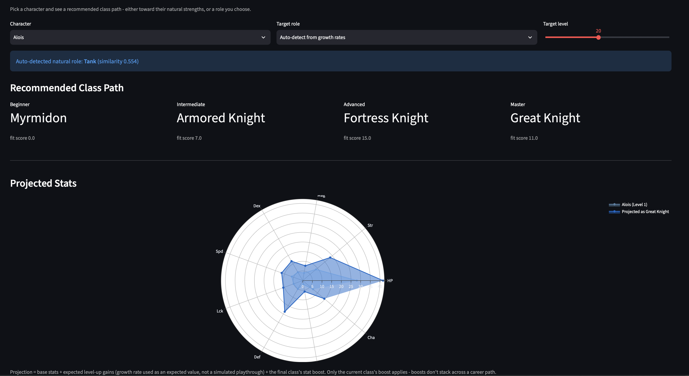

# Three Houses Class Optimizer

An interactive tool for Fire Emblem: Three Houses that recommends a class path for any character - either toward their natural strengths (auto-detected from growth rates) or a role you choose - and projects their stats at a target level.

Built as a portfolio project. Started as a Pokemon competitive team-builder; pivoted here to dig into a genuinely different kind of problem: simulating stat growth and class progression rather than looking up static competitive data.



## Features

- Scrapes character base stats, growth rates, and class stat boosts directly from [Serenes Forest](https://serenesforest.net/three-houses/)
- **Auto-detected role** - infers what a character is naturally good at from their growth rates, standardized against the roster and compared via cosine similarity against 5 role archetypes: Physical Attacker, Magic Attacker, Tank, Support, Speed/Precision - no input needed
- **Manual role targeting** - override the auto-detection to ask "what if I built this character as a mage instead?"
- **Class path recommendation** - best-fitting class at each tier (Beginner -> Intermediate -> Advanced -> Master) toward the target role, truncated to whichever tiers are actually reachable at the target level (e.g. targeting level 15 stops after Intermediate, since Advanced requires level 20). Target level defaults to 30.
- **Eligibility-aware** - recommendations respect character-locked and gender-locked classes (e.g. "Lord" is only ever recommended to the three house leaders, "Falcon Knight" only to characters who can access it), so the tool never suggests a class that character couldn't actually take in-game
- **Weapon requirements and natural proficiency** - every recommended class step shows its real certification-exam requirement (e.g. "Requires: Axe C and Heavy Armour D"), hand-curated from Serenes Forest; a character's own starting weapon proficiency (their highest starting skill rank(s), also sourced from Serenes Forest) feeds into the tier-agnostic weapon-affinity fallback used when a tier's stat-boost data alone can't distinguish physical from magic classes
- **Mix and match** - override the recommended class at any tier with any other class that character is eligible for, and see the projected stats recompute for whichever tier you actually end on (only the current/final class's boost applies in-game, same as before - the earlier tiers are still independently browsable for path comparison)
- **Stat projection with two chart types** - expected stats at a chosen level, shown as a before/after radar chart AND a grouped bar chart against the character's Level 1 base stats, so you can compare shape (radar) or read exact per-stat deltas (bar)
- **"Why" explanations** - every recommended class step, and every team member's slot, comes with a plain-language reason (the stat boosts that drove it, or - when the tier's stat data genuinely can't differentiate a role, like Magic vs. Physical at Beginner tier - the certification weapon/magic requirement and starting-proficiency match that did instead)
- **Route-aware team building, including Silver Snow** - Black Eagles splits into two selectable routes: Crimson Flower (Edelgard stays) and Silver Snow (Edelgard and Hubert leave permanently around Chapter 11 and become unrecruitable). Blue Lions and Golden Deer are each one pool. Every route's pool is that route's own house students plus the Protagonist and the Church/Knights of Seiros staff, who are recruitable on any route; DLC-exclusive characters (Cindered Shadows) are opt-in and clearly tagged `(DLC)` everywhere they appear, never mixed in silently
- **Deeper recruitment modeling** - an optional "Model recruitment requirements" toggle additionally considers students from a route's other two houses, gated by their real in-game recruitment requirement (a Byleth-level threshold - the target level slider stands in for it - plus a stat/skill-rank requirement shown as a note). House leaders and their sworn retainers are never recruitable this way, matching the game
- **Team variety and targeting** - "Different team, same pool" regenerates via weighted-random picks instead of the same deterministic top-scorers every time; "Must include" / "Exclude" let you build around specific characters instead of only ever getting the tool's own picks (and a name in both now correctly wins as "included," instead of silently vanishing)
- **Portrait support (bring your own art)** - the UI will show a character portrait from `assets/portraits/` if you provide one; falls back to a plain placeholder otherwise. Actual Three Houses character art isn't bundled (see `assets/portraits/README.md`) since it isn't this project's IP to redistribute.
- **Automated tests** - a stdlib `unittest` suite (`tests/`) covering the recommendation logic, team building, and a structural smoke test of the Streamlit app itself; see Testing below

## Known Simplifications

Worth being upfront about, since these are real gaps between this tool and the actual game mechanics:

- **Unique classes aren't spliced into the recommended path.** Classes like Emperor and Barbarossa (character-locked to specific lords) and Falcon Knight (gender-locked) are eligibility-checked - recommendations never suggest a class a character can't access. But Unique classes specifically still don't slot into the Beginner -> Master path itself, since they're unlocked by character-specific story beats rather than a uniform level + seal requirement, so there's no principled tier to insert them at.
- **Class progression is level-gated, and every certification exam's real weapon/skill-rank requirement is now shown** (`data/class_weapon_requirements.csv`, hand-curated from Serenes Forest), **but it isn't simulated or enforced.** We model the level half exactly (Beginner=5, Intermediate=10, Advanced=20, Master=30, verified against Serenes Forest) and truncate the path accordingly. The weapon/skill-rank half (e.g. "Swordmaster needs Sword rank A") is now surfaced as a requirement string on every path step - and a character's own starting proficiency (`data/character_weapon_talent.csv`) narrows the Beginner-tier tie-break toward classes that fit their actual starting strengths - but we still don't simulate weapon-exp gain over time, so the tool can't tell you whether a given rank is actually reachable by a given level; it still assumes proficiency ranks keep pace with character level.
- **Only the final class's stat boost is applied.** In the real game, boosts don't stack across a career path - only your current class's boost counts. The "mix and match" picker lets you choose which tier is actually your "current" one and see stats for that specific class; every other tier shown alongside it is progression flavor, not a contributor to the final numbers.
- **Stat projections are expected values, not simulations.** A 45% growth rate contributes 0.45 expected points per level, not a simulated coin-flip per level-up. This is the right number for comparing paths against each other on average, but doesn't show the range of outcomes a real playthrough could produce.
- **Character/class eligibility data is hand-curated, not scraped.** `class_eligibility.csv`, `character_gender.csv`, `class_weapon_requirements.csv`, `character_weapon_talent.csv`, and `recruitment_requirements.csv` were all built by hand from Serenes Forest (cross-checked against other sources where noted in each file's loader docstring in `src/optimizer.py` / `src/team_builder.py`), rather than added to the scraper - each is a small, stable dataset that doesn't change between game updates, so a dedicated scraping path wasn't worth the complexity for any of them.
- **The Beginner-tier weapon-affinity fallback is a narrowly-scoped tie-break, not a full weapon-rank simulation.** Per Serenes Forest, all four Beginner classes give a single +1 to an unrelated stat (Myrmidon/Spd, Soldier/Dex, Fighter/Str, Monk/Res) - none boosts Magic at all, even Monk, the class that actually leads toward Mage/Priest. `apply_weapon_affinity_fallback` in `src/optimizer.py` only ever activates when the ordinary stat data is fully uninformative for a role's primary stat(s) - it doesn't touch tiers where real Mag/Str differences already decide correctly (which is every tier past Beginner).
- **Recruitment modeling still isn't a full simulation of Byleth's own playthrough.** "Model recruitment requirements" gates cross-house recruits by a Byleth-level threshold (using the target-level slider as a stand-in for how far into the game you are) and shows the real stat/skill-rank requirement (e.g. "high Magic, Faith B") as a note - but doesn't verify that stat requirement, since this tool has no model of Byleth's own stat growth across a playthrough to check it against. House leaders and their sworn retainers (Hubert, Dedue) are correctly never offered as cross-house recruits, matching the game.
- **Team variety is weighted-random, not a curated set of alternatives.** "Different team, same pool" re-samples per role weighted toward higher-scoring candidates; it can occasionally repeat the same team by chance, and it's not aiming for "the 2nd-best team" in any globally-optimal sense - just a different reasonable one.

## Tech Stack

- **Data:** scraped from [Serenes Forest](https://serenesforest.net/three-houses/) with `requests` + `BeautifulSoup`
- **Processing:** pandas
- **Recommendation logic:** NumPy (cosine similarity for role detection, weighted scoring for class fit)
- **Dashboard:** Streamlit
- **Charts:** Plotly (radar + grouped bar)
- **Tests:** stdlib `unittest` (no extra dependency required to run them)

## Setup

```bash
# clone and enter the repo
git clone https://github.com/<your-username>/three-houses-optimizer.git
cd three-houses-optimizer

# install dependencies
pip install -r requirements.txt

# scrape character and class data from Serenes Forest
python src/scrape_serenes.py

# launch the dashboard
streamlit run app.py
```

You can also use the recommender from the command line directly. Run these
as modules (`-m`) from the project root, not as direct file paths - some
scripts import from others, and `-m` mode resolves those imports correctly:
```bash
python -m src.optimizer Bernadetta
python -m src.optimizer Dedue --role "Magic Attacker" --level 30
python -m src.team_builder --house "Blue Lions" --size 6
python -m src.team_builder --house "Black Eagles (Silver Snow)" --size 8
python -m src.team_builder --size 8
python -m src.team_builder --house "Golden Deer" --include-dlc --size 6
python -m src.team_builder --house "Black Eagles (Crimson Flower)" --include-cross-house-recruits --target-level 20
python -m src.team_builder --must-include "Lysithea,Dedue" --exclude "Felix" --size 6
python -m src.team_builder --size 6 --seed 42   # weighted-random variety instead of the same team every time
```

## Testing

The recommendation logic, team-building logic, and a structural smoke test
of the Streamlit app itself are covered by a stdlib `unittest` suite - no
`pytest` or other extra dependency required:

```bash
python -m unittest discover -s tests -v
```

`tests/test_app_smoke.py` imports and calls `app.py`'s render functions
directly against a minimal bundled Streamlit/Plotly stand-in
(`tests/stubs/`, used automatically if a real Streamlit isn't installed in
the environment the tests run in) so the app's Python logic gets exercised
even in a sandbox without the real packages available - it is not a
substitute for actually running `streamlit run app.py` and looking at it,
which is still worth doing before every release.

## Project Structure

```
three-houses-optimizer/
├── assets/
│   └── portraits/                   # bring-your-own character art - see its README
├── data/
│   ├── character_base_stats.csv
│   ├── character_growth_rates.csv
│   ├── class_stat_boosts.csv
│   ├── class_eligibility.csv           # hand-curated, not scraped - see Known Simplifications
│   ├── character_gender.csv            # hand-curated, not scraped - see Known Simplifications
│   ├── class_weapon_requirements.csv   # hand-curated, not scraped - see Known Simplifications
│   ├── character_weapon_talent.csv     # hand-curated, not scraped - see Known Simplifications
│   └── recruitment_requirements.csv    # hand-curated, not scraped - see Known Simplifications
├── docs/
│   └── screenshot.png
├── src/
│   ├── scrape_serenes.py
│   ├── optimizer.py
│   └── team_builder.py
├── tests/
│   ├── test_optimizer.py
│   ├── test_team_builder.py
│   ├── test_app_smoke.py
│   └── stubs/                       # minimal Streamlit/Plotly stand-in used only by test_app_smoke.py
├── app.py
├── requirements.txt
├── .gitignore
└── README.md
```

**`src/`**
- `scrape_serenes.py` - pulls character and class data from Serenes Forest, with manual BeautifulSoup row parsing (not `pandas.read_html()`) to correctly handle the site's spoiler-toggle rows
- `optimizer.py` - the recommendation logic: role detection, level-gated and eligibility-aware class path selection, weapon-requirement lookups, and stat projection
- `team_builder.py` - builds a balanced, eligibility-aware team from a candidate pool via round-robin selection across auto-detected roles; also owns route-aware (including Silver Snow) candidate pooling (`get_candidate_pool`), cross-house recruitment modeling, must-include/exclude filtering, and the weighted-random variety mode

**`app.py`** - the Streamlit dashboard.

## Roadmap

- [x] **Data pipeline:** scrape character stats, growth rates, and class stat boosts
- [x] **v1 recommender:** auto-detected or manually-targeted role, class path recommendation, stat projection
- [x] **Dashboard:** interactive character/role/level picker with path and radar+bar charts
- [x] **Team composition layer:** recommend a full squad covering complementary roles, not just one character at a time
- [x] **Level-gating:** recommended paths are truncated to tiers actually reachable at the target level
- [x] **Unique-class eligibility:** character-locked and gender-locked classes are respected across both the class-path recommender and the team builder
- [x] **Weapon requirements and natural proficiency** *(this release)*
- [x] **Silver Snow route and deeper recruitment modeling** *(this release)*
- [x] **Mix-and-match class picker and a bar-chart stat view** *(this release)*
- [x] **Automated test suite** *(this release)*
- [ ] **Skill-proficiency requirements as a real simulation:** the requirement data now exists (`class_weapon_requirements.csv`) but isn't simulated against weapon-exp gain over time - still assumes proficiency ranks keep pace with level
- [ ] **Deploy publicly**

## Data Source

Character and class data via [Serenes Forest](https://serenesforest.net/three-houses/), a fan-maintained Fire Emblem reference site. Base stats, growth rates, and class stat boosts are scraped directly (`src/scrape_serenes.py`); class eligibility, character gender, class weapon requirements, character weapon talent, and recruitment requirements are hand-curated from the same site (see Known Simplifications) since none of that data is in a cleanly scrapable tabular form.
